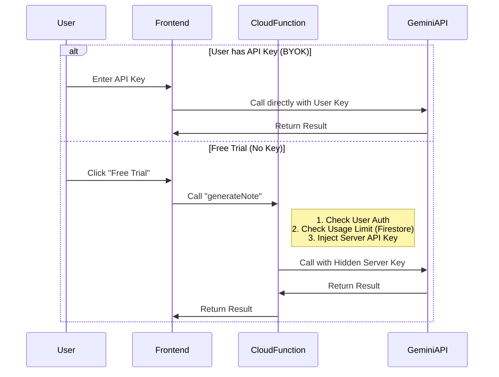

# Implementing Secure AI Features using Firebase Cloud Functions
> A comprehensive guide to building a "Free Trial" feature with hidden API Keys.

## 1. Overview & Architecture

### The Problem
Client-side apps (React, Vue, etc.) cannot safely store sensitive secrets like `GEMINI_API_KEY`. If you use the key directly in the browser, anyone can steal it.

### The Solution: Cloud Proxy Pattern
We use **Firebase Cloud Functions** as a secure middleman.
1.  **Trial User**: Frontend calls Cloud Function -> Function adds API Key -> Calls Gemini -> Returns result (`Free Trial`).
2.  **Paid User**: Frontend uses User's API Key -> Calls Gemini directly (`BYOK - Bring Your Own Key`).



---

## 2. Prerequisites (Critical for Avoiding Errors)

Before starting, ensure you meet these requirements to avoid the **Deployment Errors** we encountered:

1.  **Firebase Blaze Plan**: Cloud Functions require the "Pay as you go" plan (Spark plan does not support Node.js functions).
2.  **Node.js Version**: 
    -   **Local**: Install Node.js 20 or 22 (Match the cloud runtime).
    -   **Cloud**: Configure `engines` in `package.json` to `"22"`.
3.  **Firebase CLI**: Update to the latest version (`npm install -g firebase-tools`).

---

## 3. Backend Implementation (Firebase Functions)

### Step 3.1: Initialize Functions
Run this in your project root:
```bash
firebase init functions
# Select: TypeScript
# Select: Use ESLint? No (optional but easier for quick start)
# Select: Install dependencies? Yes
```

### Step 3.2: Configure Environment Variables (Crucial!)
> [!IMPORTANT]
> **LESSON LEARNED**: **Do NOT use `functions.config()`**.
> As of `firebase-functions` v7+, the old config method is deprecated and causes runtime crashes. You **MUST** use the new `params` module and `.env` files.

**Create `functions/.env`:**
```env
GEMINI_API_KEY=your_actual_google_ai_studio_key_here
```

### Step 3.3: Install Dependencies
Inside the `functions/` folder:
```bash
cd functions
npm install firebase-functions@latest firebase-admin@latest @google/genai
```

### Step 3.4: Write the Proxy Function (`functions/src/index.ts`)
Use this robust pattern that handles CORS and Auth automatically:

```typescript
import * as functions from "firebase-functions/v1";
import { defineString } from "firebase-functions/params"; // <--- NEW WAY
import * as admin from "firebase-admin";
import { GoogleGenAI } from "@google/genai";

admin.initializeApp();

// Define the parameter to read from .env
const geminiApiKey = defineString("GEMINI_API_KEY");

export const callGeminiProxy = functions.https.onCall(async (data, context) => {
    // 1. Security Check
    if (!context.auth) {
        throw new functions.https.HttpsError("unauthenticated", "Login required.");
    }

    // 2. Rate Limiting (Firestore Transaction)
    const userRef = admin.firestore().collection("users").doc(context.auth.uid);
    // ... (Add transaction logic to check trial_usage_count < 5) ...

    // 3. Access Secret Key
    const apiKey = geminiApiKey.value(); // <--- READ KEY SAFELY
    const ai = new GoogleGenAI({ apiKey });

    // 4. Call AI
    const response = await ai.models.generateContent({
        model: "gemini-1.5-flash",
        contents: data.contents
    });

    return { text: response.text || "" };
});
```

### Step 3.5: Deploy
```bash
firebase deploy --only functions
```

---

## 4. Frontend Implementation (React / Client)

### Step 4.1: Firebase Config
Ensure `functions` is exported in your `firebaseConfig.ts`:
```typescript
import { getFunctions, connectFunctionsEmulator } from "firebase/functions";
const app = initializeApp(firebaseConfig);
export const functions = getFunctions(app);
```

### Step 4.2: Service Layer (`geminiService.ts`)
Implement the **Failover Logic**:

```typescript
import { httpsCallable } from 'firebase/functions';
import { functions } from '../firebaseConfig';

export const getGeminiResponse = async (prompt: string, userApiKey?: string) => {
  // 1. Strict Check: Is there a valid User Key?
  // (Note: Check length to avoid dummy keys like "aaa")
  if (userApiKey && userApiKey.trim().length > 30) {
     // -> Call Gemini Direct (Client-side)
     return callDirectGemini(prompt, userApiKey);
  } 
  
  // 2. Fallback: Use Cloud Proxy (Free Trial)
  else {
     const callProxy = httpsCallable(functions, 'callGeminiProxy');
     const result = await callProxy({ contents: prompt });
     return result.data.text;
  }
};
```

---

## 5. Troubleshooting & Lessons Learned (The "Debug Journey")

If you follow the guide above, you will avoid these errors. Here is what we faced and fixed:

| Error Message | Cause | Solution |
| :--- | :--- | :--- |
| `Error: Node.js 18 is no longer supported` | Firebase deprecated old Node versions. | Set `"engines": { "node": "22" }` in `functions/package.json`. |
| `FirebaseError: functions.config() has been removed` | `firebase-functions` v6/v7 removed the old config API. | **Do NOT** use `functions.config()`. Use `defineString` and `.env` files. |
| `Error: function terminated` (Timeout/Crash) | Missing API Key or Unhandled Promise Rejection. | Check Cloud Logs. Ensure `.env` is uploaded (it is auto-uploaded by modern CLI). |
| `Direct Gemini Error: 400 Invalid Key` | Frontend tried to use a dummy key (`"aaa"`) directly. | Update frontend logic to validate key **length** before using it. Force Proxy if key is short/invalid. |
| `TS2345: Argument of type 'CallableContext' ...` | Mismatch between `firebase-functions` v1 vs v2 types. | Use `import * as functions from "firebase-functions/v1";` for stability with existing codebases. |

## 6. Verification Checklist

- [x] **Deploy Check**: `firebase deploy` returns "Deploy complete".
- [x] **Config Check**: `.env` file exists and contains the key.
- [x] **Code Check**: `index.ts` uses `defineString`.
- [x] **Logic Check**: Frontend properly switches to Proxy when Key is empty.
